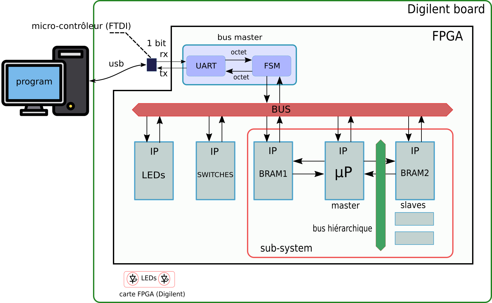
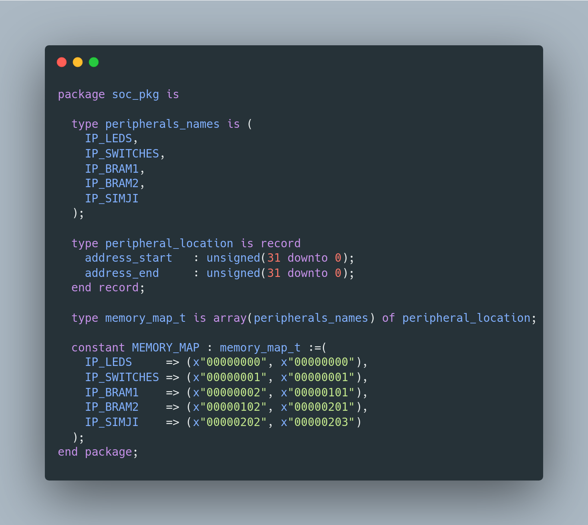

# Simji softcore & System-on-Chip

The present project is a simple SoC, depicted below, centered around a home-made processor, named Simji.

### System-on-chip architecture
A component named Bus master allows a computer to interact with the system through USB/Serial.




### Memory map



## Softcore
Simji softcore is a simple 32-bits softcore written in VHDL.

Its instruction set is reduced and simple to understand: less than 20 instructions.

It features a _Harvard-style_ architecture, where instruction and data memories are physically separated in two block-rams on FPGA, allowing simultaneous access to both. It runs at 50Mhz on a Xilinx Artix-7 (Digilent Nexys A7 boards), but _do not_ depend on any proprietary library.

A  [companion project](https://github.com/JC-LL/simji) provides Simji ISS (instruction set simulator), that also allows to assemble and disassemble programs.

Today Simji has no C compiler, but I am not far from something usable (stay tuned !).

## Instruction set
The instruction set resembles MIPS-like ISA.

- r0 always contains 0.

- o and a can either be an immediate signed value or a register

| instruction   | description | note |
| ------------- | ----------- |------|
| add   r1,o,r2   | r2:=r1 + o   |      |
| sub   r1,o,r2   | r2:=r1 - o   |      |
| mul   r1,o,r2   | r2:=r1 * o   |      |
| div   r1,o,r2   | r2:=r1 / o   |      |
| or    r1,o,r2   | r2:=r1 \| o  |      |
| and   r1,o,r2   | r2:=r1 & o   |      |
| xor   r1,o,r2   | r2:=r1 ^ o   |      |
| shr   r1,o,r2   | r2:=r1 << o  |      |
| shl   r1,o,r2   | r2:=r1 >> o  |      |
| slt   r1,o,r2   | r2:=r1 < o   |      |
| sle   r1,o,r2   | r2:=r1 <= o  |      |
| seq   r1,o,r2   | r2:=r1 == o  |      |
| load  r1,o,r2   | r2:=M[r1+o]  |      |
| store r1,o,r2   | M[r1+o]:=r2  |      |
| jmp   o,r       | r=PC+1;PC=o  |      |
| braz  r,a       | PC=a if r==0 |      |
| branz r,a       | PC=a if r!=0 |      |
| scall n         | system call |      |
| stop            |             |      |

- The core is not pipelined today and each instruction takes two cycles to complete : its performance is 25 Mips on Artix7 clocked at 100Mhz.

### Binary format & opcodes


### VHDL coding

- The VHDL design style of the core is deliberately **not** structural, buts is based on a finite-state machine : the core acts as a command/instruction interpreter, similar to the ISS, which is easier to understand for students. It underlines the power of RTL _inference_.


## How to synthesize ?

```bash
cd syn
vivado -mode tcl -source script.tcl
```

## How to program the FPGA ?

```bash
cd syn
djtgcfg -d NexysA7 prog -i 0 -f ../syn/SYNTH_OUTPUTS/top.bit
```

## How to interact with Simji softcore ?
Simple Ruby scripts are provided to show how to :
- read and write a program in Simji memories
- start the processor
- inspect its status
- etc


## Contact
Simji by itself is a support tool for Digital Design Courses at ENSTA Bretagne, Brest France.

Don't hesitate to drop me an email if you find this project interesting.

email : jean-christophe.le_lann at ensta-bretagne.fr
